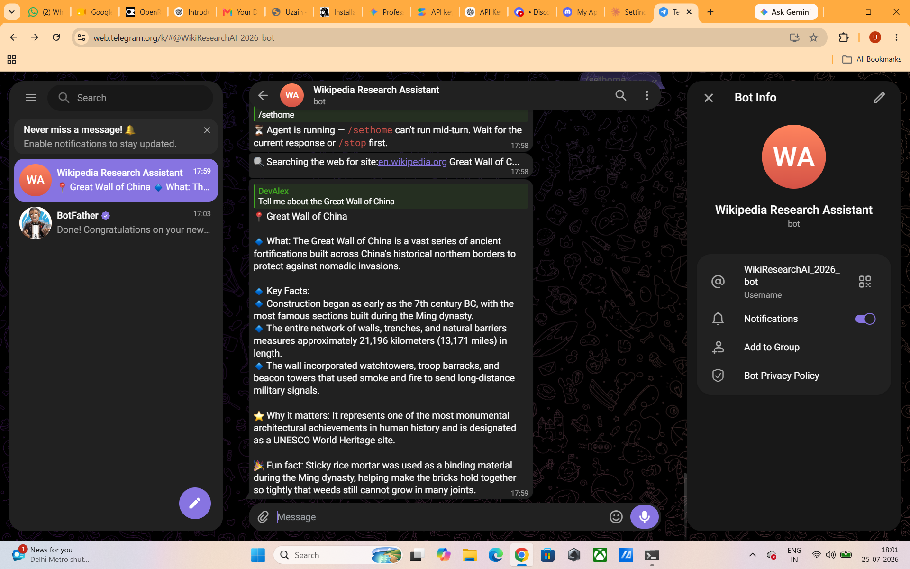
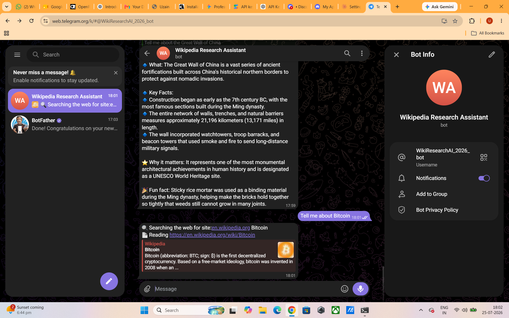
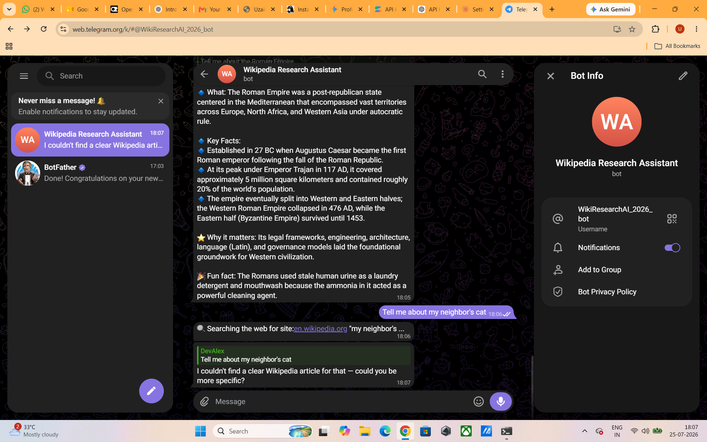

# Wikipedia Research Assistant

An AI-powered Telegram bot that answers "Tell me about X" questions by fetching real Wikipedia content and returning a structured, easy-to-read summary.

Built during my Hoardy AI internship (Week 1) using Hermes CLI, Google AI Studio (Gemini), and the Telegram Bot API.

## What it does

Ask the bot about any topic — a person, place, event, or concept — and it:
1. Searches the web and fetches the relevant Wikipedia article
2. Extracts the key information
3. Replies in a clean, consistent format:

📍 [Topic Name]

🔹 What: [one-sentence definition]
🔹 Key Facts:
🔹 [fact 1]
🔹 [fact 2]
🔹 [fact 3]

⭐ Why it matters: [one sentence on significance]

🎉 Fun fact: [one surprising detail]

If a topic doesn't exist on Wikipedia or is too vague, it replies with a graceful fallback instead of guessing or breaking format.

## How it works

- **Agent runtime:** [Hermes CLI](https://hermes-agent.nousresearch.com/) (Nous Research) — handles the chat loop, tool calls, and gateway connection to Telegram
- **Model:** Gemini (via Google AI Studio free tier) — generates the actual summaries
- **Web/Wikipedia fetch:** Hermes's built-in web tool (DuckDuckGo backend, free, no API key)
- **Chat platform:** Telegram, connected via Hermes's built-in gateway (`hermes gateway start`)
- **Formatting control:** a strict `platform_hints.telegram` prompt override in `config.yaml`, which ensures every reply follows the exact template above regardless of the underlying model's default style

The full prompt is saved in this repo's linked Gist: **https://gist.github.com/uzainmohid/723a15271f219370d65e22f19397f7c7**

## Setup summary

1. Installed Hermes CLI on Windows via the official PowerShell installer
2. Connected a free Google AI Studio API key (Gemini) as the model provider
3. Created a Telegram bot via @BotFather and connected its token to Hermes's gateway
4. Wrote and iteratively refined a system prompt to enforce a strict, structured output format
5. Tested across 10+ topics spanning science, history, technology, and pop culture, plus an unknown-topic case to confirm graceful fallback behavior

## Challenges faced

- **Free-tier model availability:** the first free OpenRouter model hit a "no endpoints available" error due to privacy/guardrail settings; switched to Google AI Studio's free Gemini tier instead.
- **Missing platform dependencies:** Hermes's optional Discord and Telegram support packages (`discord.py`, `python-telegram-bot`) weren't installed by default and needed to be added manually into Hermes's virtual environment.
- **Discord guild messages not received:** hit a confirmed open bug in Hermes Agent (issue #43070) where the bot receives DMs and slash commands but never regular server channel messages. Switched to Telegram, which doesn't have this issue.
- **Formatting not applied in gateway mode:** `system_prompt` and `SOUL.md` worked correctly in the CLI but weren't consistently picked up by the Telegram gateway session. Fixed by adding a dedicated `platform_hints.telegram` override in `config.yaml`, and by starting a fresh session after each prompt change.

## Screenshots

**History topic** — *"Tell me about the Great Wall of China"*

**Technology topic** — *"Tell me about Bitcoin"*, including the live Wikipedia search step

**Graceful fallback** — *"Tell me about my neighbor's cat"* correctly triggers the fallback message instead of guessing

Additional topics tested during development (format held consistent across all): Photosynthesis, Artificial Intelligence, Eiffel Tower, Albert Einstein, Amazon Rainforest, World War II, Solar System.
